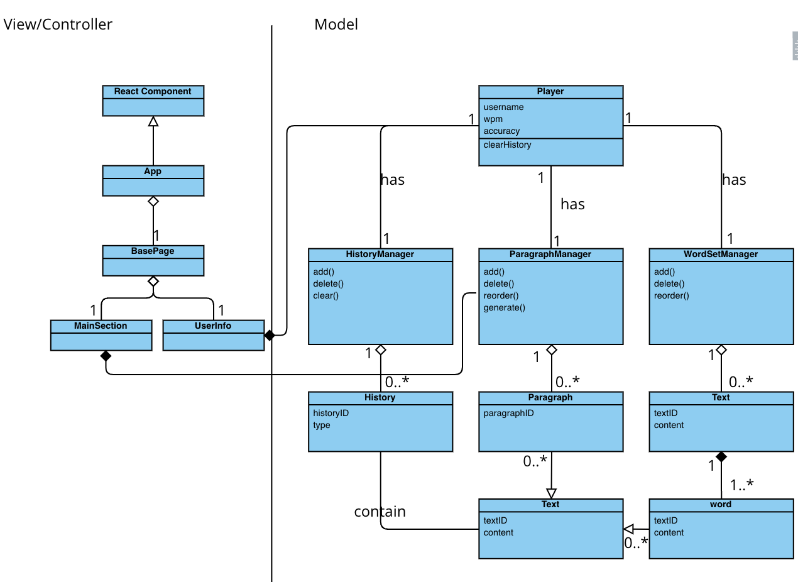

# FlashFingers Business Requirement

## Nouns & Verbs

I will highlight **nouns in bold**, and *verbs in italics*.

**FlashFingers** is an interactive typing **game** designed to enhance typing skills through engaging **challenges** and immediate **feedback**. **Players** are presented with random **paragraphs** to *type* as quickly and accurately as possible, offering a unique and dynamic experience with each **session**. The game *provides* real-time feedback through **color-coded text** and **sound effects** to indicate **accuracy** and **typing speed**. Key features include the calculation of **typing speed (words per minute, WPM)** and **accuracy**, based on correct and incorrect **keystrokes**. Additionally, FlashFingers allows players to *review* their game **history** to track progress over time and offers the option to *upload* **custom texts** for a personalized typing experience.

* **Players** are *given* **random paragraphs** and *type* them as accurately and quickly as possible.
* Players will get **immediate feedbacks** like **colors** and **sounds** while typing.
* FlashFingers will *record* the **time** and thus *calculate* the **speed (words per minute, wpm)**.
* During the game, Players can see a *progress bar* based on their average speed.
* FlashFingers can also calculate **accuracy** based on the number of times they *enter* **incorrect characters**.
* Players can *browse* their **game history**.
* Players can *upload* their own **texts** to the game.

## Target audience

People who want to learn typing, increase typing speed, and improve the literacy skills of a new language.

## Rules

* All the data are stored in local storage.
* In a game, the length of text is no more than 200 characters.
* If a game is interrupted, it won't be recorded.
* In the initial phase of development, only support English character input.
* The game stores up to 100 records.

## Challenge Questions

* Do the players only play on PC browsers? If so, should the interface be responsive?
* If players don't do any other actions, they just type, one paragraph by another paragraph, would the game end?
* In terms of accuracy and speed, does the game record them for each paragraph seperately or average of all the texts?
* The game will give texts randomly by default, can players sort the "playlist" at their will? (endless and myPlaylist)
* What is the maximum size of a file that players can upload, and what format?
* How many records should the game store? Are there any restrictions?

## Summary of Classes, Attributes and Associations

Player:

* id (attribute)
* name (attribute)

ParagraphManager:

* addParagraph() (method)
* deleteParagraphById (method)
* shuffle (method)
* getParagraphById (method)
* getParagraphs (method)

Text:

* id (attribute)
* content (attribute)

Game:

* id (attribute)
* textId (attribute)
* wpm (attribute)
* accuracy (attribute)
* pressCnt (attribute)
* errorCnt (attribute)
* startTime (attribute)
* endTime (attribute)
* userInput (attribute)
* completed (attribute)
* startGame (method)
* endGame (method)

GameManager:

* createGame (method)
* startGame (method)
* endGame (method)
* processInput (method) 
* calcWPM (method)
* calcAccuracy (method)

History:

* id (attribute)
* gameId (attribute)

HistoryManager:

* addHistory (method)
* getHistories (method)
* clearHistory (method)
* calcAvgWPM (method)
* calcAvgAccuracy (method)

# User stories

* **Tech vs Non-Tech**
* **Juniors vs Seniors**
* Children vs Adults
* Students vs Professionals
* English vs Non-English

**Tech & Juniors:** Sophie is a 15-year-old high school student with interests in gaming and technology. Actually, she has grown up with digital devices and often chat with her friends online. She types very fast but she feels uncomfortable writing long essays and often get points off because of typos. **As a motivated student, Sophie wants to improve her typing accuracy, because FlashFingers has statistics and she can track her progress.**

**Non-Tech & Juniors:** Aaron is a 18-year-old football player, but unfortunately, he got injured and cannot continue playing. Therefore, he is seeking out another opportunity in office. **As a non-tech student, he wants to practice typing in FlashFingers, because the immediate feedbacks make him feel immersive and the endless texts encourage him to practice for a long time without even realizing it.**

**Tech & Seniors:** Usher is a 60-year-old retired software developer, who always has passion for technology. He is looking for ways to keep mentally sharp and avoid Alzheimer's disease. He doesn’t have the energy to dive deep into the latest skills anymore, but he thinks typing, one thing he has been doing for more than 40 years, is a good idea. **As a typing master, Usher wants to upload some literature text to FlashFingers and type them, because this way, he not only keeps typing, but he can be also able to enjoy some literary works that he had no time to read before.**

**Non-Tech & Seniors:** Linda is a 55-year-old retiree who was a gardener and has never been much interested in technology. She only uses basic cell phone and occasionally browses the internet on a desktop computer. But recently her son went to college in another state, and she wants to practice typing so that he could send emails and messages to her son. **As a computer novice and a mother who misses her son, Linda wants to use FlashFingers to cultivate the typing skill, because it is a game after all that she can practice in a stress-free environment.**

# Interface low level mockups

The index page is a new game, which naturally encourage players to start trying this game.

The left-top is the name or logo of the game, and the right-top is basic info of the player.

Players can go to differect page by the navigator (Game / Upload / History).

In the main section, players will type based on the given text. If they type in letters correctly, text color will become green, otherwise, red.

After they type in all the text correctly, the game ends, and a congratulation message shows.

This massage will disappear in 3 seconds automatically, and the next game starts.

In the upload page, players can inpu their own content, or upload their files by clicking the "choose file" button.

In the history page, players can browse their game records, and they can also play a game again.

# UML Class Diagram

# Citation

I used GPT4.0 for generating sample paragraphs.

> prompt: I am creating a typing game. Specifically, I will provide paragraphs for users, and they will type those text. Please give me 20 paragraphs about whatever topics, and each of no more than 200 characters.
